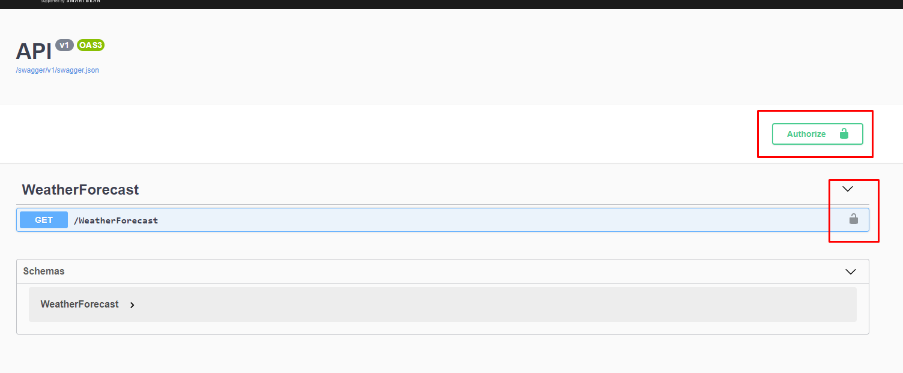
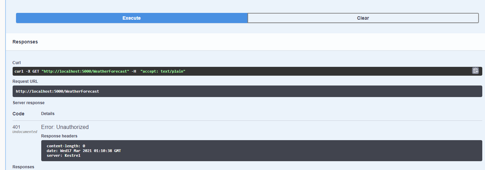
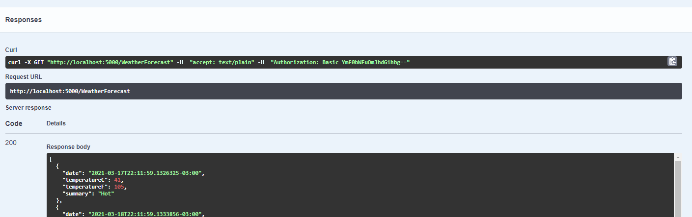

# .NET 5 Autenticação básica com swagger

Repositório contendo um exemplo de código que demonstra como trabalhar com uma autenticação básica no swagger.


### Implementações no código

Nesse repositório nós temos uma interface chamada: `Domain/IUsuarioServico.cs` e a sua implementação: `Service/UsuarioServico.cs` para que possamos ter uma autentição *chumbada* básica que simule uma validação de usuário e senha.

```Csharp
//IUsuarioServico.cs
 public interface IUsuarioServico
    {
        bool ValidaCredenciais(string usuario, string senha);
    }
```

```Csharp
//UsuarioServico.cs
  public class UsuarioServico : IUsuarioServico
    {
        public bool ValidaCredenciais(string usuario, string senha)
        {
            return usuario.Equals("batman") && senha.Equals("batman");
        }
    }
```

Depois nós temos uma classe para que possamos fazer uma *Authentication Handler* customizada.


```Csharp
//BasicAuthenticationHandler.cs

public class BasicAuthenticationHandler : AuthenticationHandler<AuthenticationSchemeOptions>
    {
        readonly IUsuarioServico _usuarioServico;

        public BasicAuthenticationHandler(IUsuarioServico usuarioServico,
            IOptionsMonitor<AuthenticationSchemeOptions> options,
            ILoggerFactory logger,
            UrlEncoder encoder,
            ISystemClock clock)
            : base(options, logger, encoder, clock)
        {
            _usuarioServico = usuarioServico;
        }

        protected override async Task<AuthenticateResult> HandleAuthenticateAsync()
        {
            string usuario;
            try
            {
                var authHeader = AuthenticationHeaderValue.Parse(Request.Headers["Authorization"]);
                var credentials = Encoding.UTF8.GetString(Convert.FromBase64String(authHeader.Parameter)).Split(':');
                usuario = credentials[0];
                var senha = credentials[1];

                if (!_usuarioServico.ValidaCredenciais(usuario, senha))
                    throw new ArgumentException("Credenciais invalidas!");
            }
            catch (Exception ex)
            {
                return AuthenticateResult.Fail($"Erro de autenticação: {ex.Message}");
            }

            var claims = new[] {
                new Claim(ClaimTypes.Name, usuario),
                new Claim(ClaimTypes.Role, "Admin")
            };
            var identity = new ClaimsIdentity(claims, Scheme.Name);
            var principal = new ClaimsPrincipal(identity);
            var ticket = new AuthenticationTicket(principal, Scheme.Name);

            return AuthenticateResult.Success(ticket);
        }

    }
```
Por fim nós atualizamos a nossa classe `Startup.cs`:


```Csharp
//Startup.cs
 public void ConfigureServices(IServiceCollection services)
        {

            //outras implementações
            services.AddSwaggerGen(c =>
            {
                //outras implementações
                c.AddSecurityDefinition("basic", new OpenApiSecurityScheme
                {
                    Name = "Autorização",
                    Type = SecuritySchemeType.Http,
                    Scheme = "basic",
                    In = ParameterLocation.Header,
                    Description = "Autenticação básica utilizando usuário e senha."
                });
                c.AddSecurityRequirement(new OpenApiSecurityRequirement
                {
                    {
                          new OpenApiSecurityScheme
                            {
                                Reference = new OpenApiReference
                                {
                                    Type = ReferenceType.SecurityScheme,
                                    Id = "basic"
                                }
                            },
                            new string[] {}
                    }
                });
            });

            #region [DI]
            services.AddAuthentication("BasicAuthentication").AddScheme<AuthenticationSchemeOptions, BasicAuthenticationHandler>("BasicAuthentication", null);

            services.AddScoped<IUsuarioServico, UsuarioServico>();
            #endregion
        }


        public void Configure(IApplicationBuilder app, IWebHostEnvironment env)
        {
           //outras implementações
            app.UseAuthentication();
            //outras implementações
        }

```

### Testando o projeto

Executando o código note que temos um cadeado agora e um botão para que possamos autenticar:


Clicando no botão Authorize deve abrir uma modal, preencha com os dados *batman* no usuário e *batman* na senha, em seguida tente acessar o endpoint `WeatherForecast` e note que você tem permissão.

Teste sem auth:


Teste autenticado:


Obs.: Note que a classe `BasicAuthenticationHandler` é requisitada a todo momento, ela funciona como um middler de autenticação.